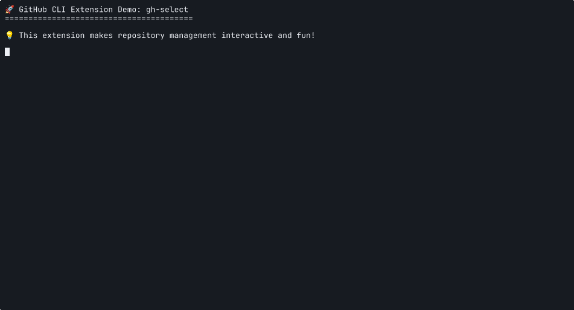

# 🔍 gh-select - Interactive Repository Selector

The GitHub CLI's repo command is ***absolutely* terrible**. On smaller screens / views it's unusable,  cloning is annoying with long/unknown names.. 🗣️🗣️🗣️



A **native GitHub CLI extension** that adds interactive repository selection functionality to the `gh` command. No more struggling with truncated repository lists or having to guess repo names or eventually going to web to clone..

## 🛠 Installation

### Prerequisites

Make sure you have these tools installed:

- **GitHub CLI** (`gh`) - [Install here](https://cli.github.com/)
- **fzf** (fuzzy finder) - `brew install fzf` (macOS) or `apt install fzf` (Ubuntu)
- **jq** (JSON processor) - `brew install jq` (macOS) or `apt install jq` (Ubuntu)

#### 🎯 GitHub CLI Extension Install (Recommended)
```bash
# Install as GitHub CLI extension
gh extension install remcostoeten/gh-select
```

#### Alternative: One-Line Install
```bash
# Install for current user only (integrates with GitHub CLI)
curl -sSL https://raw.githubusercontent.com/remcostoeten/gh-select/master/install.sh | bash
```

#### Global Install

```bash
# Download and install globally (requires sudo)
curl -sSL https://raw.githubusercontent.com/remcostoeten/gh-select/master/install.sh | sudo bash -s -- --global
```

### Manual Installation

#### For All Users (Global Installation)
```bash
git clone https://github.com/remcostoeten/gh-select.git
cd gh-select
sudo ./install.sh --global
```

### Installation Options

| Method | Command | Benefits | Usage |
|--------|---------|----------|---------|
| **User Install** | `./install.sh` | Integrates with GitHub CLI | `gh select` |
| **Global Install** | `sudo ./install.sh --global` | Available to all users | `gh-select` |
| **Force Install** | `./install.sh --force` | Overwrites existing installation | `gh select` |

### Verify Installation

```bash
# For user installation
gh select --help
gh extension list

# For global installation
gh-select --help
which gh-select
```
## 🚀 Usage


```bash
# Launch interactive repository selector
gh select
```

### Available Actions

Once you select a repository, you can:

21. **🔽 Clone Repository** - Clone to current directory or custom path
2. **📋 Copy Repository Name** - Copy `owner/repo-name` to clipboard
3. **🔗 Copy Repository URL** - Copy `https://github.com/owner/repo-name` to clipboard
4. **🌐 View in Browser** - Open repository on GitHub.com
5. **❌ Cancel** - Exit without action

### Help & Version

```bash
# Show help
gh select --help

# Show version
gh select --version
```

## 🤝 Contributing

you do you brotha


## 📄 License

MIT License - see [LICENSE](LICENSE) file for details.

xxxx,

**Remco Stoeten**

---

⭐ **If this extension helped you, please star the repository!** ⭐

It helps me grow my e-penor. More stars = more e-karma
